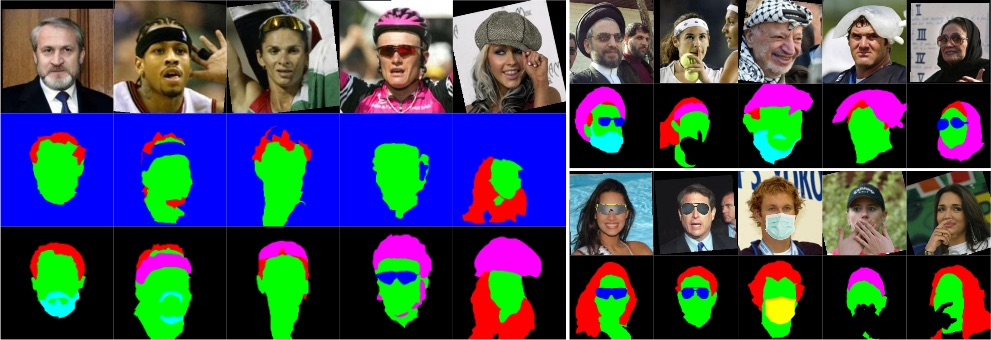

# Extended Labeled Faces In-The-Wild (ELFW)

Development code on face semantic segmentation for Extended Labeled Faces In-The-Wild (ELFW).		
Dataset and further details at the [Project Site](https://multimedia-eurecat.github.io/2020/06/22/extended-faces-in-the-wild.html).



>**Examples from the ELFW dataset**. Original LFW categories *background*, *skin*, and *hair*, new categories *beard-mustache*, *sunglasses*, *head-wearable*, and exclusively synthetic *mouth-mask*. (left) Re-labeled faces with manual refinement compared to the original LFW labels in blue background, (right-top) faces previously unlabeled in LFW, and (right-bottom) synthetic object augmentation with sunglasses, mouth-masks, and occluding hands.


## What is this file for

- `run_trainer.py`: main file to be run for training (see below).
- `trainer.py`: the trainer, i.e. SGD, scheduler, epochs, loss, and all deep learning artillery.
- `models.py`: the NN architectures, namely FCN, DeeplabV3, and GCN.
- `elfw.py`: the dataloader and label conversion utilities for the ELFW dataset.
- `transform.py`: image transformations (scaling, flips, relabeling,...) for data augmentation.
- `metrics.py`: useful compendium of metrics including pixel accuracy, mean accuracy, mean IoU, frequency weighted, and Mean F1-Score.
- `utils.py`: some utilities for console output, time metering, or early-stopper.
- `visualize.py`: handy visdom class for performance visualization on web navigator.
- `tester.py`: use this file for segmenting an image of your own once having a trained model.


## How to train

Training settings are described in `run_trainer.py`. Some arguments are called via console, while other hyperparameters are fixed. See `list_experiments.sh` for an exhaustive list of experiments carried out during the project.

```python
max_epochs     = 301      		# Maximum number of epochs 
lr             = 1E-3     		# Learning rate
lr_decay       = 0.2      		# Learning rate decay factor
w_decay        = 5E-4     		# Weight decay, typically [5e-4]
momentum       = 0.99     		# Momentum, typically [0.9-0.99]
lr_milestones  = [35,90,180] 	# lr milestones for a multistep lr scheduler
augment        = True     		# random transformations for data augmentation
gcn_levels     = 3        		# Number of GCN levels, typically 3 for 256x256 and 4 for 512x512 image sizes
```

Trained models not at disposal for the moment.

#### Main Frameworks

- `Python 3.5`, `PyTorch 1.1.0`, `TorchVision 0.3.0`, `Visdom 0.1.8`, `PIL 6.2.1`.
- Data augmentation: `OpenCV 3.1.0` and `Dlib`.


## Included Networks for Semantic Segmentation

- **FCN**: Long, J., Shelhamer, E., Darrell, T.: Fully convolutional networks for semantic segmentation. In: Proceedings of the IEEE conference on computer vision and pattern recognition. pp. 3431–3440 (2015).

- **DeeplabV3**: Chen, L.C., Papandreou, G., Kokkinos, I., Murphy, K., Yuille, A.L.: Deeplab: Semantic image segmentation with deep convolutional nets, atrous convolution, and fully connected crfs. IEEE transactions on pattern analysis and machine intelligence 40(4), 834–848 (2018).

- **GCN**: Peng, C., Zhang, X., Yu, G., Luo, G., & Sun, J. (2017). Large kernel matters--improve semantic segmentation by global convolutional network. In Proceedings of the IEEE conference on computer vision and pattern recognition (pp. 4353-4361). [ *Not considered for the paper* ]


## Jupyter demos

The folder `./demos` contains code snippets to test the GCN model over the webcam. Have a look to [Jupyter Notebooks](https://jupyter.org/) or [Colab](https://colab.research.google.com/).


## Handy scripting toolbox

The folder `./scripts` contains some useful code tools for labeling and processing the dataset. Main files are:

- `computeClassWeights.py`: computes weight for class balancing over the training loss.
- `elfw-makeThemWearMasks.py`: overlays synthetic masks (must provide) on face images.
- `elfw-makeThemWearSunglasses.py`: same for sunglasses.
- `elfw-putYourHandsOnMeWithDlib.py`: same for hands based on Dlib.
- `elfw-scribbleMe.py`: tool for label annotation by filling superpixels on mouse scribbling.
- `elfw-refineMe.py`: tool for refining the annotated segments.


## BibTeX Citation
	@article{redondo2020extended,
	  title={Extended labeled faces in-the-wild (elfw): Augmenting classes for face segmentation},
	  author={Redondo, Rafael and Gibert, Jaume},
	  journal={arXiv preprint arXiv:2006.13980},
	  year={2020}
	}
--- 
	Rafael Redondo and Jaume Gibert (c) 2019-20 Eurecat
